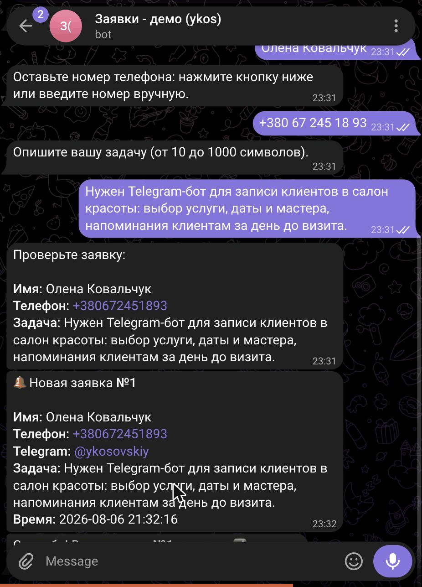
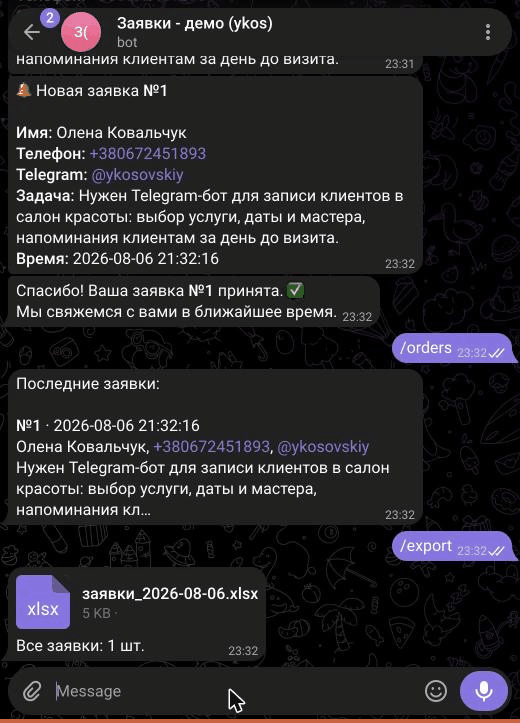

# Telegram-бот приёма заявок

Бот для малого бизнеса: клиент за минуту оставляет заявку прямо в Telegram — имя, телефон, описание задачи. Владелец мгновенно получает уведомление в личку, смотрит последние заявки командой и выгружает всю базу в Excel. Никаких форм на сайте, CRM и лишних сервисов.

**Живой бот:** [@ykos_demo_orders_bot](https://t.me/ykos_demo_orders_bot) — откройте и нажмите Start.

## Как это выглядит


| Диалог с клиентом | Уведомление владельцу |
|---|---|
|  |  |

## Возможности

**Для клиента**
- Пошаговый диалог: имя → телефон → описание задачи → подтверждение
- Кнопка «Поделиться контактом» — номер вводить не обязательно
- Проверка каждого шага: бот вежливо переспросит, если ввод некорректный
- `/cancel` — отменить заявку на любом шаге

**Для владельца**
- Уведомление в личку сразу при новой заявке
- `/orders` — последние 10 заявок
- `/export` — выгрузка всех заявок в .xlsx
- Админ-команды работают только для владельца (по ID из настроек)

## Стек

- Python 3.11+, [aiogram 3](https://docs.aiogram.dev/) (асинхронный фреймворк для Telegram Bot API)
- SQLite — без ORM, чистый SQL
- openpyxl — выгрузка в Excel

## Запуск локально

```bash
git clone <repo-url>
cd telegram-orders-bot

python3 -m venv venv
source venv/bin/activate        # Windows: venv\Scripts\activate
pip install -r requirements.txt

cp .env.example .env
# В .env вписать:
#   BOT_TOKEN — токен от @BotFather
#   ADMIN_ID  — свой Telegram ID (узнать у @userinfobot)

python src/bot.py
```

База данных создаётся автоматически при первом запуске.

## Структура

```
src/
  bot.py        # точка входа, запуск polling
  config.py     # чтение .env
  database.py   # SQLite: таблица заявок
  handlers.py   # логика диалога и админ-команды
  states.py     # шаги диалога (FSM)
  keyboards.py  # кнопки
  export.py     # выгрузка в xlsx
```
